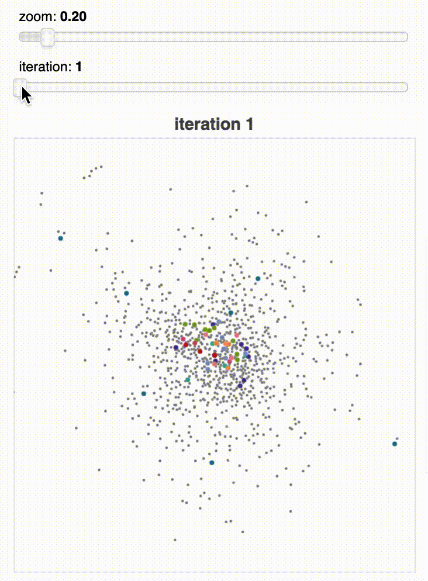

# pandemaniac
CS144 Pandemaniac Visualizer! 10,000 nodes requires a good deal of patience, 5,000 a moderate amount of patience, and 2,000 a modicum of patience.

\>>> `git clone https://github.com/atisor73/pandemaniac`

\>>> ```cd pandemaniac/```

\>>> ```python setup.py install```

<br>

Here is a demonstration of the TA's demolishing us:

\>>> `import pandemaniac`

\>>> `pandemaniac.viz(G, [seed1, seed2, ... ])`




